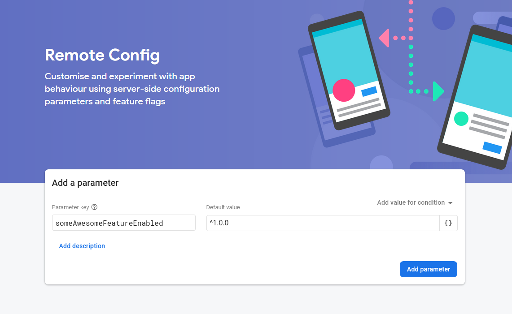
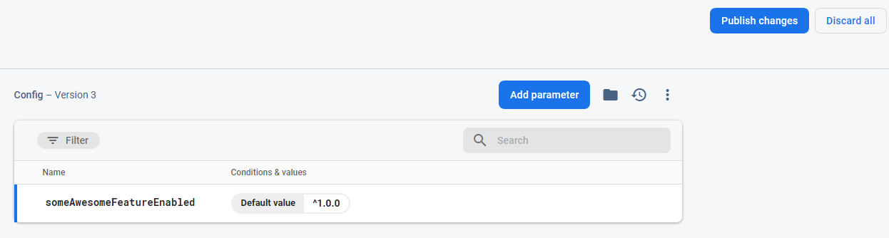

**Feature flags** (toggles / switches), as the name suggested, are for switching on and off certain features in your application. You can add feature flags to perform A/B testing by switching on beta features for some users. You can use them as a fail-safe switch in case something goes wrong in production. Or you can use them to hide your work-in-progress features.

Here I'm going to show you how to implement features flags with Firebase Remote Config with React.

### Getting Started

#### 1. Initialize Firebase 🔥

We need to install 2 packages for this demo. If you've already setup Firebase then just install `semver`, I'll explain what's it for later.

```
yarn add firebase semver
```

Then, create a file `firebase.js` to initialize the Firebase instance along with other Firebase services you need, which would be `remote-config` in our case.

```js
// firebase.js
import Firebase from 'firebase/app';
import 'firebase/remote-config';

const firebaseConfig = {};

export const firebase = Firebase.initializeApp(firebaseConfig);
```

Head over to your [Firebase Console](https://console.firebase.google.com) and create a new project if you don't have one. Then go to the Project Settings page to get your Firebase SDK configs and paste it into `firebase.js`.

```js
// Example
const firebaseConfig = {
  apiKey: "Your Api Key",
  authDomain: "yourapp.firebaseapp.com",
  databaseURL: "https://yourapp.firebaseio.com",
  projectId: "yourapp",
  storageBucket: "yourapp.appspot.com",
  messagingSenderId: "Some ID",
  appId: "Some ID",
  measurementId: "Some ID"
};
```

With the `firebase` instance initialized, we can pass it around and invoke all the available services.

#### 2. Create Remote Flags in Firebase 🎏

In your Firebase Console, head to the Remote Config section. You can find it under the Grow section on the left side menu.

You should see the following if it's your first setup. Enter a parameter key which will be our feature flag name and its default value which will be a semantic versioning string `^1.0.0`. The string will be related to the `semver` package that we installed at the beginning. I'll explain it in the next section.



Click **Add parameter** and you should reach this page.



Click **Publish changes** and you'll have your first feature flag ready to use!

#### 3. Create FlagsProvider Component

In order to share your feature flags across your app, we need to create a FlagsProvider which fetches all the remote flags we created above and share them through the Context API.

First, create a `FlagsContext` and get the `remoteConfig` instance. Since all the fetched remote configs will be cached in your browser's IndexDB, we can adjust the maximum age of the cache in development, i.e. `minimumFetchIntervalMillis`. Obviously, you can also manually delete the cache yourself.

Our provider component should take in a `defaults` prop for setting the default values of your feature flags. We'll save them in a `flags` state and pass it to our Provider below, so we can trigger a re-render when we set new flags.

```jsx
import React from 'react';
import semverSatisfies from 'semver/functions/satisfies';
import { firebase } from './firebase';

const FlagsContext = React.createContext({});
const remoteConfig = firebase.remoteConfig();

// For development only
remoteConfig.settings = {
  minimumFetchIntervalMillis: 3600000,
};

const FlagsProvider = ({ defaults, children }) => {
  const [flags, setFlags] = React.useState(defaults);

  // Next Part

  return (
    <FlagsContext.Provider value={flags}>{children}</FlagsContext.Provider>
  );
};

export default FlagsProvider;
```

Next, we'll add an `useEffect` hook. We need to assign our `defaults` prop as the default config. Then we fetch and activate all the remote flags. We would then loop through the remote flags and set our `flags` state.

```jsx
const FlagsProvider = ({ defaults, children }) => {
  // ...
  React.useEffect(() => {
    remoteConfig.defaultConfig = defaults;
    remoteConfig
     .fetchAndActivate()
     .then(activated => {
        if (!activated) console.log('not activated');
        return remoteConfig.getAll();
     })
     .then(remoteFlags => {
       const newFlags = {
         ...flags,
       };
       for (const [key, config] of Object.entries(remoteFlags)) {
         const appVer = process.env.REACT_APP_VERSION;
         newFlags[key] = 
            semverSatisfies(appVer, config.asString());
       }
       setFlags(newFlags);
    })
    .catch(error => console.error(error));
  }, []);
  // ...
};
```

Here's where `semver` helps us determine the boolean state of a flag. The `semverSatisfies` function checks if a given version number satisfies a versioning range.

**To illustrate how it works,**

We would retrieve our app version from our environment variables.

> Simply add `REACT_APP_VERSION=$npm_package_version` to your `.env` file in this example which would retrieve the version number from your `package.json`.

We have 1 remote flag which is `['someAwesomeFeatureEnabled', '^1.0.0']`.

Assuming our app version is 1.0.1 , `semverSatisfies('1.0.1', '^1.0.0')` would return true. 

And finally we call `setFlags({ someAwesomeFeatureEnabled: true })`.

#### 4. Wrap your App with FlagsProvider

```jsx
import React from 'react';
import FlagsProvider from '...';

const App = () => {
  return (
    <FlagsProvider
      defaults={{
        someAwesomeFeatureEnabled: false,
      }}
    >
      <App />
    </FlagsProvider>
  );
}
```

Finally, wrap the FlagsProvider to your root App and specify the defaults prop. The flag names **MUST** match the ones you set in your Firebase Console. Or else it won't be able to fetch the corresponding flags.

### How to Access your Flags

To make your life easier, you can create a custom hook for retrieving your flags from your `FlagsContext`.

```jsx
export const useFlags = () => {
  const context = React.useContext(FlagsContext);
  return context;
}
```

You can now toggle your awesome feature like this 👏,

```jsx
const Component = () => {
  const { someAwesomeFeatureEnabled } = useFlags();
  return (
    <div>
      {someAwesomeFeatureEnabled && <SomeAwesomeFeature />}
    </div>
  )
}
```

### All Done!

It's such a development changing experience for me. I can keep working on new features and once they're ready, I can simply switch on the flag instead of redeploying the app.

If you want to add more flags, simply add them to Firebase and the `defaults` prop. And remember to update your app version every time your deploying a new version!

Remote Config can also be done in React Native as well. The APIs will be slightly different but the concept is the same. Check out React Native Firebase [here](https://rnfirebase.io).

Also, you have a lot of flexibility in specifying the versioning range, check out the docs [here](https://github.com/npm/node-semver#ranges).

Until next time, hope you'll find this demo useful.😄