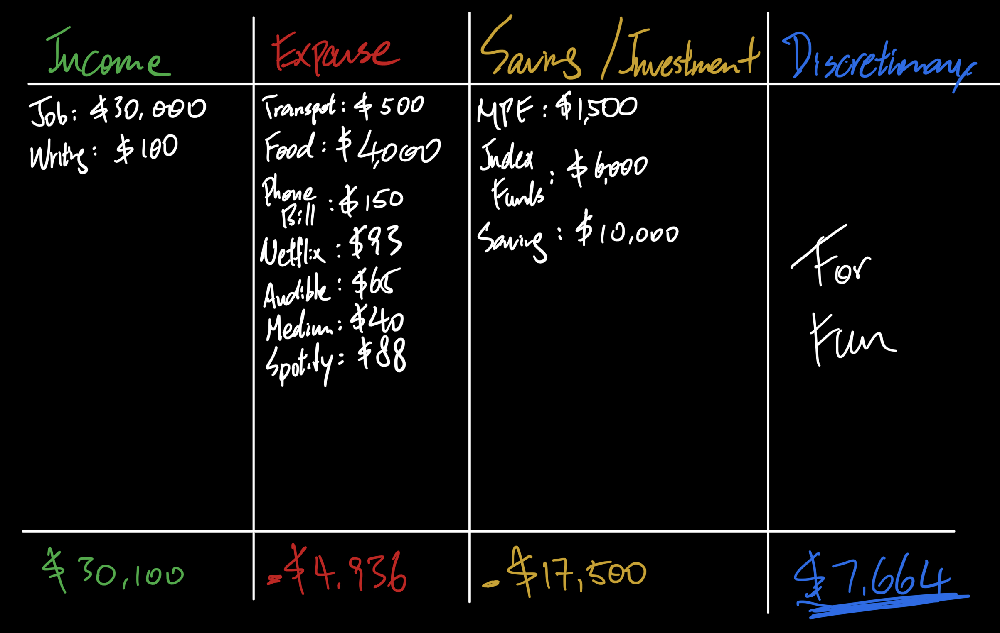
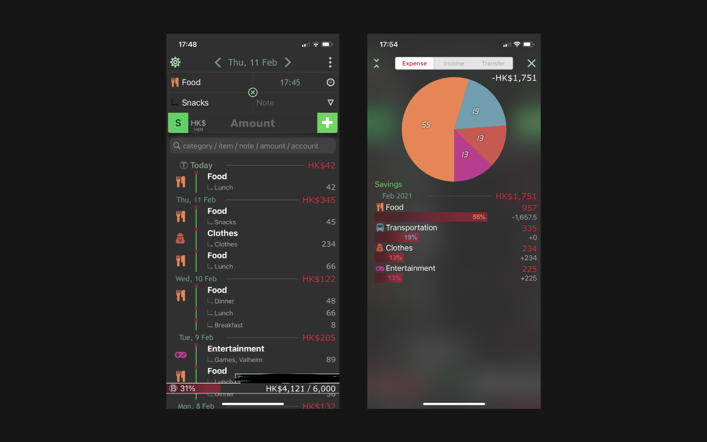
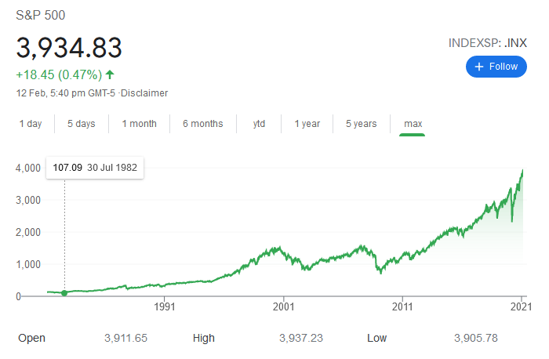

💰 Personal Finance is a topic I wished I've learnt in an earlier stage. Unless you are a transcendent being who sees money as nothing but scraps, either the poor and the rich should learn to build proper money habits. If you seek a decent quality of life like getting good education, starting and taking care of your family or any sort of personal pursuits, money will always be in the equation. Life responsibilities require actions to fulfill them.

I would like share how I personally stay ahead of my finances and hopefully you'll understand the importance behind.

#### Write Down your Income and Expense

We are visual animals and tend to make sense of what we see. And most of the time, we tend not to believe or realize the objective reality until it's right in front of us. There's no denial of facts when it comes to money.

To understand your finances, the best way is to give yourself a reality check on what you're doing with your money. **Be honest and precise**.

*Monthly Expense Example (in HKD)*

Basically, you would write down your income, expense and saving / investment, then calculate the total of each column. And finally calculate your discretionary which is the remaining money you have for random disposals like entertainment, medication or goods. 

> In this example:  
> $30,100 - $4,936 - $17,500 = $7,664

Afterwards you can maneuver the numbers in each column. The rule of thumb is optimize your money allocation and gain the most for yourself. In simpler words, cut all your nonsense expense and put them into better use. For example, lowering your food expense by picking more economical restaurants or cutting your Netflix subscription if you barely use it.

The money you've saved can go into your saving / investment, or your discretionary as a result. If you find your discretionary is way too much, it's probably better to save or invest more.

Don't underestimate the slightest number on your table. You can cut your expense by $100 each month. That's $1,200 a year which can be used in more sensible ways like buying more books, more budget for your next travel trip or taking your family out for a decent meal. Do the math and you'll realize how much you can potentially save in the long run.

If it's just impossible for you to touch any of your expense or savings, which means you have chosen a more challenging path, so to speak. Then you must find ways to build up your income. This could take tremendous amount of effort and time compared to **cutting expenses which you could do it immediately with greater effectiveness**. It's ultimately your choice my friend.

#### Track your Spending and Set a Monthly Budget

To further keep yourself accountable for your finances, you can track your spending every day. Just take 5 minutes of your day and write down what you've spent. Make it a habit and remind yourself everyday that you're not a slave to money.

I track my spending with an app - [1SecMoney](https://www.1secspeed.com/1SecMoney/). It's the best that I can find in the Asia market. I could have been using [Mint](https://mint.intuit.com/) if it's available in HK but sadly it isn't 😢. You can also use apps that connects to all your bank, credit card and investment accounts and automatically sync up your spending. Check out [Planto](https://www.planto.hk/en/) and [Gini](https://app.gini.co/en/) in HK. I prefer doing it myself in order to build a habit.

*1SecMoney Screenshots*

Tracking won't stop you from over-spending. That's why I would set a monthly budget for myself. 20% more than your average monthly expense would be a good starting point. For example, I spend approximately $5,000 per month, then my monthly budget would be $5,000 x 1.2 = $6,000. Refer back to your expense table and adjust to the amount considerately. The budget meter in 1SecMoney made me more anxious about my expenditures in a good manner.

#### Invest in Market

>**Basic Economics 101: Your money loses value overtime thanks to inflation.** 💸

We need imprint this concept deep in our minds. Whatever worth of money is sitting in your bank right now would slowly devalue. The current average inflation rate is around 2 - 2.5%, which means stuff costs 2 - 2.5% more than the year before. I still remember a bowl of wanton noodles cost $19 in 2000s, and it's $34 in 2020s which is 80% more expensive. That's also a 3% inflation rate over 20 years!

If we ever have a bank account that offers the same interest rate as the inflation, we wouldn't have to worry about our money. Unfortunately, banks usually offer less than 1% of interest. Your wealth is subjugated under this circumstance.

Here's where investment can come in to counter inflation, particular investing in the stock market which is comparatively accessible to everyone. Other investment products like real estates, gold or cryptocurrencies require more capital, hence, expose to proportionally more risk.

The sensible approach to stock market investment would be through index funds aka Exchange-Traded Funds (ETFs). By investing in ETFs, you are actually investing in multiple companies to keep it simple. An eminent example would be the [Vanguard S&P 500 ETF (VOO)](https://investor.vanguard.com/etf/profile/VOO) which tracks the S&P 500 Index. And basically you are investing in the top 500 US companies if you were to purchase a share of VOO.

The average annual return of S&P 500 of the last decade is roughly 11%, which is above the overall average of 10%. This mitigated inflation and a portion of your money would become more valuable if you had invested in the last 10 years.

*S&P 500 Index Trend*

Keep in mind that we are talking about **DECADES** when we are investing in ETFs to gain such returns. And ETFs diversifies your investment which means you are not just betting on a single sector that could potentially be obsoleted in the future. I have been investing for a year by now. My major portion of investment goes into VOO and making a profit of 20%. I'm planning to at least keep them growing for 10 to 15 years. Long-term investment would be your safest bet from a statistical standpoint and I trust math😆. Unless there's an apocalyptic warfare which by then you should have more urgent matters to attend to than your piles of numbered paper.

Before starting to invest, make sure you have setup an emergency fund which should be at least 3 - 6 months of your monthly expense. This is a safety net just in case suddenly life hits you in the face asking for money. You need to be confident that the money you've invested does not put your basic livelihood in harms way.

> Just going to plug my company [SoFi HK](https://www.sofi.hk/) here in case you wish to start investing with no cost at all. We strive for simplicity which makes investing easy. I believe beginners would find our platform friendly. 

#### Be Patient and Invest in Yourself

This might sound like a cliche but it is an undisputable fact. Your knowledge generates the most value for yourself. 

I would spend money and time on online courses, books and videos. They taught me how to code, how to invest, how to read, how to play a song on the guitar, how to workout, how to skate, how to share your work and ultimately how to take responsibility in life and be better every day.

All these knowledge you have accumulated would someday propel you forward. You can apply them in your job, your side hustles or your interests. You would instantly become more valuable to others. And obviously the more valuable you are, the more people are willing to pay for your quality service. You can get promoted in your job or seek better opportunities. You can get paid for your media content like videos, music, art and articles. You can start a company with your expertise or interest. These provide multiple streams of income when you refer back to your expense table.

Your limitless potential from your self-investment makes you a dangerous being. And God only knows what you could possibly achieve in life with such arsenal.